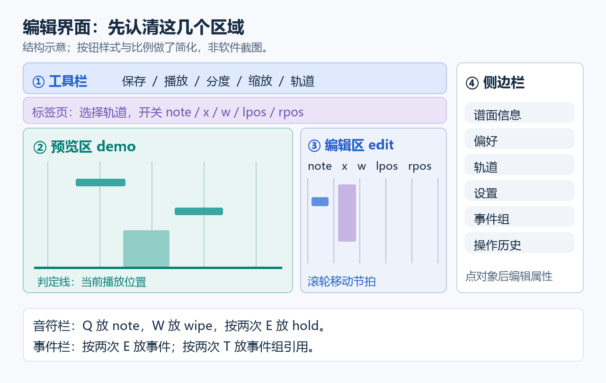

# Dakumi 文档

本文档按当前开发分支整理。软件显示的版本号与开发分支的功能不一定同步，旧发行包请结合对应的更新日志阅读。

## 第一次使用

先对照图找到音符栏和事件栏，再按下面的步骤开始编辑。

1. 完整解压发行包并启动程序，不要只复制 `dakumi.exe`。
2. 在选曲界面拖入 `wav`、`mp3` 或 `ogg` 文件，创建歌曲和空白谱面。
3. 选择歌曲后，可以拖入背景图片（`jpg` / `jpeg` / `png`）和已有谱面（`json` / `d3`）。旧 `d3` 会转换为 JSON，不必手动改后缀。
4. 点击编辑。左边预览轨道，右边 edit 区从左到右是音符、x、w、lpos、rpos 五栏。
5. 鼠标停在音符栏，按 `Q` 放 note、`W` 放 wipe；按两次 `E` 放 hold 的头和尾。在事件栏按两次 `E` 放事件。终点须晚于起点。
6. 按 `Space` 播放 / 暂停，滚轮移动节拍，按 `Ctrl + S` 保存。

`offset` 用毫秒填写；节拍写成“整数、分子、分母”，例如 `{2, 1, 4}` 是 2 又 1/4 拍。默认偏好下，位置和宽度以 100 为一整份。

## 保存与用户文件

手动保存写入当前选中的谱面文件，并非总是名为 `chart.json`。自动保存开启后，每 60 秒在 `users/auto_save/` 留一份副本，演示模式期间不执行自动保存。默认每张谱面保留 50 份、保留期限 30 天，总容量目标 256 MB；每张谱面最近一份始终保留，详见[保留策略](测试与备份.md)。需要恢复时，选择对应歌曲，再导入副本。

手动保存失败会显示错误，并在已生成 JSON 内容时询问是否复制到剪贴板。选择复制后，请立即粘贴到文本文件并保存为 `.json`；复制并不代表原谱面文件已保存成功。自动保存失败记入日志，不弹窗打断编辑。

| 位置 | 内容 |
| --- | --- |
| `users/chart/<歌曲>/` | 音乐、谱面和背景 |
| `<谱面路径>.editToolData` | 每张谱面的分度、缩放、当前轨道、栅栏、播放速度与放置开关；没有时自动创建 |
| `users/settings.json` | 全局设置 |
| `users/key.json` | 自定义快捷键 |
| `users/ui/` | 自定义图片和 `theme.yml` |
| `users/auto_save/` | 自动保存副本 |
| `users/log/` | 运行和错误日志 |
| `users/export/` | 导出文件 |
| `plugins/` | 外部插件 |

例如 `chart.json` 的编辑数据是同目录的 `chart.json.editToolData`。移动或备份谱面时可一起保留；它不是谱面格式的一部分。操作历史仅在当前运行中保留，切换谱面会清空，不写入上述文件。

## 继续阅读

- [编辑手册](edit_manual.md)：标签页、轨道筛选、快捷键、改键位、操作历史。
- [事件组](event_groups.md)：一组轨道变化在多个位置复用。
- [Takana 导入](takana_import.md)：拖入 t3pkg、t3proj 或难度 JSON，按 1/256 拍拟合。
- [主题](theme.md)：昼夜配色、图标与音符图片缩放。
- [声纹图](spectrogram_manual.md)：频率范围、音名刻度、分析方式与颜色。
- [开发入门](../DEVELOPMENT.md)、[架构与接口](../DEVELOPER_GUIDE.md)、[插件开发](../plugins/README.md)。

## 服务索引与自动检查

[服务索引](服务索引.md)覆盖全部服务入口及 ChartService 内部文件；[测试与备份](测试与备份.md)说明本地检查、CI 和自动保存保留策略。

元件毫秒位置调整见[偏移时值说明](time_offset.md)。

- [每条轨道的效果（开发中）](track_effect.md)
- [轨道初始值](track_start_values.md)：无 event 时的 x/w/lpos/rpos 初始值。
