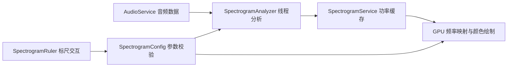

# 服务与内部模块索引

`src/services/` 当前有 25 个 Lua 文件：15 个顶层入口和 ChartService 的 10 个内部实现文件。文件数不等于独立服务数。以下按职责列出全部入口；新增服务时应同步更新本表。

| 模块 | 职责与主要接口 | 使用边界 |
|---|---|---|
| `chartService.lua` | 兼容入口，转发到 `chartService/init.lua`；读取和修改当前谱面、事务与撤销 | 业务层通过服务修改，不直接写 `chart` |
| `effectService.lua` | 轨道效果求值、滚动积分、跳跃位移及运动缓存 | 读取谱面并响应变更；自定义过渡结束值也参与积分 |
| `importService.lua` | `request/convert/validate/apply/saveToMenu`：导入审核、转换、资源应用和新文件保存 | 通过导入插件转换；菜单持久化使用新文件，失败清理本次输出 |
| `coordinateService.lua` | `toY/yToBeat`、`trackToScreen/screenToTrackX`、`getEventValue`：节拍、轨道与屏幕坐标换算 | 使用谱面偏好和音频时钟；不要在插件里重复换算 |
| `audioService.lua` | 加载、播放、暂停、跳转、音量、效果、异步分析数据和私有时钟 | `update(dt)` 每帧只执行一次；详见[音频服务](音频服务.md) |
| `inputRouter.lua` | `Router.new(options)`、`dispatch(method, ...)`：统一输入分发、坐标换算和弹窗捕获 | 应用创建并持有实例；UI 消耗后不再触发谱面编辑 |
| `themeService.lua` | `load`、`section`、`color`、`iconColor`、`judgeColor`、`editorColor`、`slice` 等 | 单例；返回主题配置或默认颜色，详见[主题](theme.md) |
| `spectrogramService.lua` | `:draw(sound,x,width,y0,y1)` 与 `:getStatus()`：共享声纹缓存、线程任务与 GPU 绘制 | 单例；多个标签页共享，颜色和频率变化不会重新做 FFT |
| `spectrogramConfig.lua` | 配置校验、分析档位、频率与音高换算 | 无 UI 依赖，线程和主线程使用相同规则 |
| `spectrogramAnalyzer.lua` | `new(mode,window)`、`array(size,kind)`、`:analyze(sound,frame,output,offset)` | 输出原始线性功率；不负责颜色、分贝压缩或 UI |
| `spectrogramRuler.lua` | `draw(ui,x,width)`、`zoom(factor,position,pan)`、`wheelmoved(x,y)`、`contains(x,y)` | 主线程；仅在当前帧有效标尺范围内消耗滚轮 |
| `keyCapture.lua` | `begin`、按下/松开、`confirm`、`cancel`：组合键录入 | 单例；全部松开后才能确认，录入期间由输入路由拦截 |
| `bpmMeasureService.lua` | `start(onApplied)`、`isBusy()`、`update()`：单次 BPM 和 offset 测量流程 | 主线程轮询；系统弹窗确认后才通过谱面事务写入 |
| `bpmAnalyzer.lua` | `measure(sound,progress)`：音频分析，返回 BPM、offset 与可信度 | LuaJIT/FFI 计算模块；应在线程中运行，不直接弹窗或写谱面 |
| `noteSkin.lua` | `draw(kind,image,x,y,width,height,angle)`：按主题九宫格绘制音符 | 点号调用；图片由调用者管理，切割规则来自 ThemeService |

## ChartService 的 10 个内部文件

| 文件 | 装载职责 |
|---|---|
| `init.lua` | 创建服务并按依赖顺序装配以下模块 |
| `index.lua` | 实体集合、轨道索引和排序 |
| `transactions.lua` | 事务快照、提交、回滚和修改通知 |
| `lifecycle.lua` | 设置/加载谱面与生命周期 |
| `event_groups.lua` | 事件组定义、实例计算和专用编辑模式 |
| `effect_editing.lua` | 效果列表专用编辑上下文、字段事务及恢复 |
| `custom_trans.lua` | 自定义过渡定义查询、验证、事务写入及撤销 |
| `entities.lua` | Note/Event 增删改、放置约束 |
| `fields.lua` | 谱面信息、偏好、轨道属性等字段读写 |
| `timing.lua` | BPM 表、offset、节拍/秒数换算 |

外部代码统一 `require('src.services.chartService')`，内部拆分文件由 `init.lua` 装配，不单独构造另一个谱面状态。事务和修改通知见[开发指南](../DEVELOPER_GUIDE.md)。

## 声纹图的计算与绘制



`Config.read(settings,sampleRate)` 返回安全的配置副本；`sanitize(settings)` 会原地修正设置。分析档位为 transient（2048 点 / 128 跳步）、balanced（4096 / 128）、harmonics（16384 / 128）、bass（32768 / 256）。窗函数支持 `hann` 和 `blackman_harris`。跳步指相邻分析窗口的采样间隔。

`frequency(options,position)` 和 `position(options,Hz)` 双向换算频率位置；`midi(Hz)`、`hz(midi)` 和 `pitchName(Hz)` 提供音高刻度，`cellAt` 定位时间格。输入频率必须为正数，位置通常为 0～1。音频采样率决定可显示的最高频率。

```lua
local Config = require('src.services.spectrogramConfig')
local Analyzer = require('src.services.spectrogramAnalyzer')
local options = Config.read(settings, sound:getSampleRate())
local plan = Analyzer.new(options.mode, options.window)
local power = Analyzer.array(plan.bins)
plan:analyze(sound, 0, power, 0) -- 第 0 帧；功率数组从下标 0 开始
```

帧中心为 `frame * plan.hop`；音频首尾补零。左右声道合并能量，反相声道不会互相抵消。分析结果保留完整单边功率谱；绘制时再转 dB 和颜色。默认显示 -84～0 dB；增益、透明度与频率范围只影响显示。缓存采用容量限制，线程失效时走主线程预算回退。

`Spectrogram:getStatus()` 返回 `pendingRows/rows/cacheEntries/cacheLimit/analyzedFrames/projectedFrames/uploads/renderer/workerError/shaderError/timeStep`，供开发诊断。待加载区域会被补齐；不要根据一次 draw 判断整个音频已分析完成。

`Ruler.draw` 的第一个参数为已创建的 Nuklear UI。标尺通过当前帧绘制的范围记录交互区域；`wheelmoved` 返回 true 时，外层必须停止继续分发。Shift 配合滚轮平移频率范围。`zoom` 的位置参数通常是 0～1，表示缩放锚点。

## 组合键录入

```text
idle → begin(action) → waiting → 按下组合键 → holding → 全部松开 → ready → confirm() → idle
                                         ↘ cancel() → idle
```

`begin(action)` 只接受键位表中存在的动作。`keypressed(key,isrepeat)` / `keyreleased(key)` 接收真实按键；左右 Ctrl/Alt/Shift 合并为统一名称，重复按键不会加入第二次。`isActive/isReady/getDisplay/format` 供弹窗展示。`confirm()` 成功保存后结束录入，失败时返回错误并保持弹窗；`cancel()` 放弃本次录入。不要让录入中的组合键同时执行游戏动作。

## BPM 与 offset 测量

`bpmMeasureService:start(onApplied)` 在已有任务、事件组编辑或缺少音频数据时拒绝启动。主循环调用 `update()`；更换谱面、进入/退出事件组或更换音频使旧结果失效。正在进行谱面事务时延迟应用结果。

`bpmAnalyzer.measure(sound,progress)` 接受 SoundData 和可选检查回调（无参数，可在回调中检查取消并抛出错误），返回 `{bpm,offsetMs,uncertain}`。支持 8/16 位 PCM，内部处理声道与采样率；需要至少约 2 秒音频，最长约 30 分钟。计算模块的 offset 符号与谱面字段相反，服务应用时使用 `-offsetMs`，单位均为毫秒。

确认填入后，服务通过 `ChartService:change('history.measure_bpm', ...)` 修改 offset 与第一条 BPM；后面的 BPM 保留。成功后调用 `onApplied(bpm,offset)`，取消或失败不调用。插件应调用测量服务，避免自行管理线程和弹窗。

## 音符图片

`noteSkin.draw` 的 kind 支持 `note/wipe/hold_head/hold_body/hold_tail`；具体切割与回退规则由 `ThemeService:slice(kind)` 提供。绘制服务不保存图片，不负责加载和释放。九宫格可选中间拉伸或两侧拉伸，详见[主题配置示例](theme.md)。
